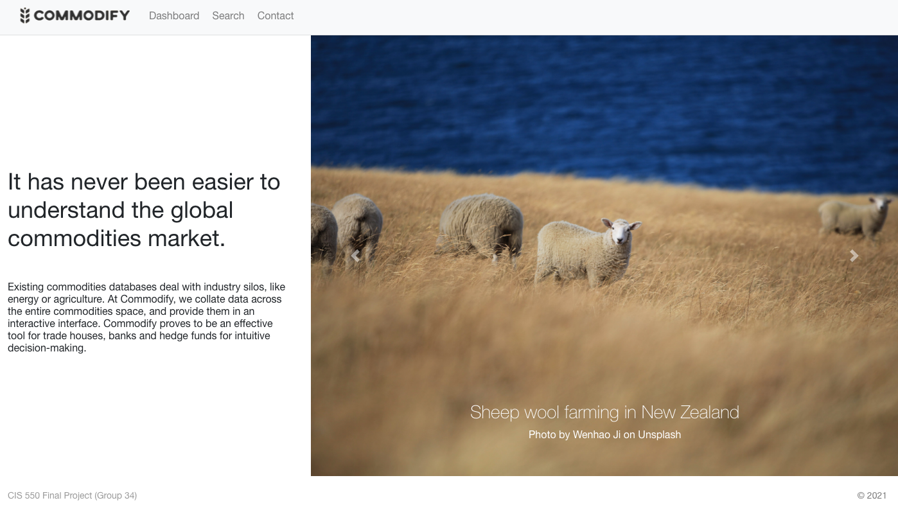
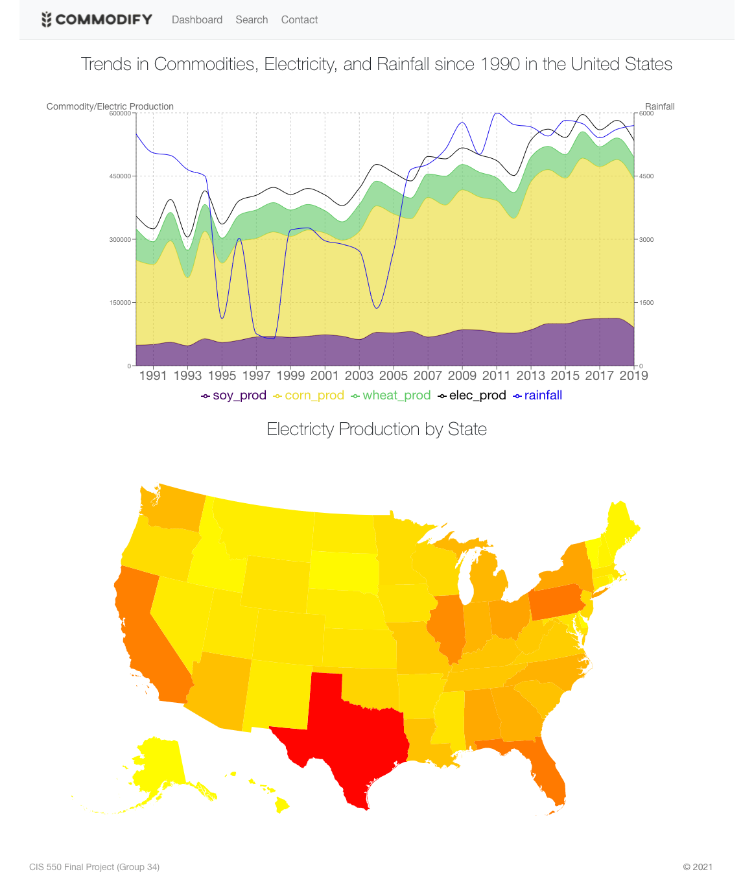
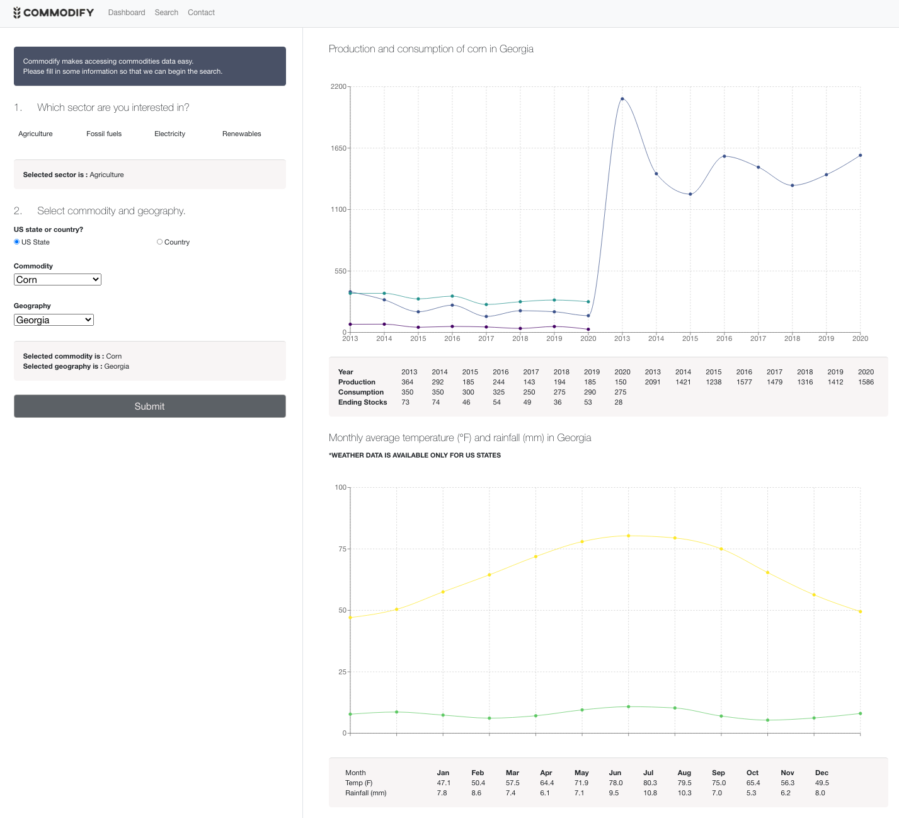

# Commodify

## Introduction

Commodify is an app to visualize and interact with commodity market and weather data.

### The problem

Existing resources deal mostly with individual sectors like energy or agriculture, but not the the whole commodities space, and they are read only. In order to get an overview of the entire market, one needs to manually integrate data from many different resources, which is time intensive and technically difficult for most traders.

### The solution

Commodify provides a "one-stop-shop" for commodities and weather data, which can be a useful resource for trade houses, banks and hedge funds.

#### Homepage



Commodify allows for seeing not only trends in the commodities markets, but also the interaction between weather and climate and prices, which are crucial determinants of commodity supply and demand. The app is divided into two pages, a "Dashboard" and a "Search" page.

#### Dashboard

The dashboard page gives the user a overview of the commodities market in graphical display formats. For the purpose of the project, the information presented on this page is for the USA only, due to the fact the data is most complete and available for the USA. The page contains two charts: the first chart presents a broad overview of production levels of commodities (soy, corn and wheat are the major stocks in USA) and electricity. Total rainfall level is overlaid and presented on the same chart to illustrate the broad relationship between rainfall levels and commodity production levels, if any. The second chart presents the total electricity production of each of the 50 USA states, levels illustrated by the colors (with red being the highest, and light yellow being the lowest).



#### Search

The search page allows the user to select a commodity sector, for example 'agriculture', or 'renewables'. After selecting one of these options the user will be presented with the option to search for country or USA state level data, and will then be shown drop-down menus for the data available. Once the selections are made and the 'Submit' button is pressed, the user will see the commodity's production and consumption data in graphical display (line chart) and tabular form. Should the user select to view commodity data for a USA state (instead of country), an additional query is performed to retrieve weather information for the selected state. Monthly average rainfall and temperature data are then presented in a separate chart and tabular format below the first chart.



### Team Members

|       Name       |        Email          |   GitHub   |
|:-----------------|:----------------------|:-----------|
|Iris Tiong        |iristyx@seas.upenn.edu |iristyx     |
|Francis Featherby |ffrancis@seas.upenn.edu|ffeatherby  |
|Peter Brice       |pbrice@seas.upenn.edu  |briceybrit  |
|Steven Brooks     |sbr@seas.upenn.edu     |stevegbrooks|

## Architecture

## Data

The datasets used in the application mainly agricultural commodities data, energy supply and demand data, as well as weather data obtained from public domains.

1. [Current and historical agricultural commodities data from the USDA Foreign Agricultural Service](https://apps.fas.usda.gov/psdonline/app/index.html#/app/downloads)

  * Description: a dataset containing commodities and their prices around the world, including trading value at the beginning and end of each month.

  * Size: ~200 MB with ~2 million rows and 12 features.

  * A commodity is identified by "Commodity_Code", and also has location, time, and various attributes attached to its value.
  
  * A quick peek at the first 5 rows of the data shows the following (column names changed for brevity; not all columns shown): 
  
	| ccode | comm | cntry | mrkt_yr | year | month | attr_id | attr | unit_id | unit_desc | val |
	|:----------|:----------|:-----------|:--------|:-----|:------|:--------|:----------|:---|:-----|:--|
	| 577400    | Almonds   | AF         | 2010    | 2018 | 10    | 20      | Beginning Stocks     | 21 | (MT) | 0 |
	| 577400    | Almonds   | AF         | 2010    | 2018 | 10    | 125     | Domestic Consumption | 21 | (MT) | 0 |
	| 577400    | Almonds   | AF         | 2010    | 2018 | 10    | 176     | Ending Stocks        | 21 | (MT) | 0 |
	| 577400    | Almonds   | AF         | 2010    | 2018 | 10    | 88      | Exports              | 21 | (MT) | 0 |
	| 577400    | Almonds   | AF         | 2010    | 2018 | 10    | 57      | Imports              | 21 | (MT) | 0 |

  * Number of unique values for each column (original column names):
  
	| col_name              |unique |
	|:----------------------|------:|
	| Commodity_Code        |    63 |
	| Commodity_Description |    63 |
	| Country_Code          |   212 |
	| Country_Name          |   213 |
	| Market_Year           |    62 |
	| Calendar_Year         |    62 |
	| Month                 |    13 |
	| Attribute_ID          |    71 |
	| Attribute_Description |    71 |
	| Unit_ID               |    11 |
	| Unit_Description      |    11 |
	| Value                 | 44725 |
	
  * Summary statistics for numeric columns:

	| Market_Year |Calendar_Year |   Unit_ID     |    Value        |
	|:------------|:-------------|:--------------|:----------------|
	|Min.   :1960 |Min.   :1959  |Min.   : 2.000 |Min.   :   -9510 |
	|1st Qu.:1979 |1st Qu.:2006  |1st Qu.: 8.000 |1st Qu.:       0 |
	|Median :1992 |Median :2006  |Median : 8.000 |Median :      15 |
	|Mean   :1992 |Mean   :2006  |Mean   : 9.833 |Mean   :   11937 |
	|3rd Qu.:2007 |3rd Qu.:2014  |3rd Qu.: 8.000 |3rd Qu.:     212 |
	|Max.   :2021 |Max.   :2021  |Max.   :29.000 |Max.   :42528700 |


2. [Current and historical energy supply and demand data from the Energy Information Agency, part of the United States Department of Energy](https://www.eia.gov/petroleum/data.php)

  * Description: data sets released weekly and monthly containing thousands of data points on US and global energy production and consumption.

  * Size: the data are provided in various packages and formats, some overlapping, but there are at least hundreds of features per week in data stretching back decades, i.e. thousands of rows.

  * The data are mostly time series. They show various aspects of supply and demand, e.g. production, consumption, inventories etc., for a given geographical region, such as a state or country, on a sequence of dates of in a sequence of periods.
  
  * Below are some example lines from a CSV file dealing with US crude oil production in the lower 48 United States by month in 2020 in thousands of barrels (column names changed for brevity).
  
	|Date       | U.S. Prod | East Coast Prod | Florida Prod | New York Prod|
	|:----------|----------:|----------------:|-------------:|-------------:|
	|2020-06-15 |     313264|             1967|            69|            23|
	|2020-07-15 |     340152|             1968|           122|            23|
	|2020-08-15 |     328099|             2189|           122|            23|
	|2020-09-15 |     326114|             2309|           108|            23|
	|2020-10-15 |     323387|             2359|           113|            23|
	|2020-11-15 |     333721|             2180|           117|            23|

  * Summary statistics:
  
	|     Date                   |   US Prod     |East Cost Prod | Florida Prod  |New York Prod |
	|:---------------------------|:--------------|:--------------|:--------------|:-------------|
	|Min.   :1981-01-15 00:00:00 |Min.   :119208 |Min.   : 399.0 |Min.   :  35.0 |Min.   : 9.00 |
	|1st Qu.:1990-12-30 12:00:00 |1st Qu.:175752 |1st Qu.: 649.5 |1st Qu.: 174.5 |1st Qu.:19.00 |
	|Median :2000-12-15 00:00:00 |Median :212585 |Median : 861.0 |Median : 370.0 |Median :28.00 |
	|Mean   :2000-12-14 11:43:27 |Mean   :223392 |Mean   :1171.7 |Mean   : 511.4 |Mean   :33.37 |
	|3rd Qu.:2010-11-30 00:00:00 |3rd Qu.:263536 |3rd Qu.:1518.0 |3rd Qu.: 542.5 |3rd Qu.:35.50 |
	|Max.   :2020-11-15 00:00:00 |Max.   :396865 |Max.   :4243.0 |Max.   :3606.0 |Max.   :96.00 |

3. [Current and historical weather data from the US National Oceanic and Atmospheric Administration (NOAA) National Center for Environmental Information (NCEI)](https://www.ncei.noaa.gov/data/global-summary-of-the-day/access/)

  * Description: a dataset containing daily weather data for weather stations in the USA, including, from 1929 to the present (2021).

  * Size: ~ over 20 GB with 28 features, including temperature, dewpoint, surface elevation, rainfall, wind speed, etc. The full dataset was downloaded and relevant information was extracted. Only state, rainfall and temperature data were retained for simplicity and usefulness.
  
  * A quick peek at the first 5 rows of the data shows the following (column names changed for brevity; not all columns shown): 
  
	| Entity_id | Year | Month | Temperature | Precipitation | 
	|:----------|:-----|:------|:------------|:--------------|
	| 108       | 1931 | 1     | 30.35       | 70.96         | 
	| 108       | 1931 | 2     | 35.96       | 46.42         | 
	| 108       | 1931 | 3     | 43.77       | 35.48.        | 
	| 108       | 1931 | 4     | 10.00       | 10.00.        | 
	| 108       | 1931 | 5     | 12.90       | 12.90         | 

  * Number of unique values for each column (selected useful column):

	| col_name              |unique |
	|:----------------------|------:|
	| Entity_id	        |    53 |
	| Year		        |    91 |
	| Month                 |    12 |
	| Temperature           |  7524 |
	| Precipitation         |  5985 |

	
  * Summary statistics for numeric columns:

	|Entity_id   |   Year      | Temperature  |Precipitation  |
	|:-----------|:------------|:-------------|:-------------|
	|Min.   :1   |Min.   :1931 |Min.   :-10.2 |Min.   :0     |
	|1st Qu.:109 |1st Qu.:1960 |1st Qu.:41.06 |1st Qu.:2.9   |
	|Median :159 |Median :1981 |Median :56.54 |Median :10.58 |
	|Mean   :152 |Mean   :1980 |Mean   :54.82 |Mean   :17.84 |
	|3rd Qu.:197 |3rd Qu.:2001 |3rd Qu.:70.25 |3rd Qu.:30.35 |
	|Max.   :262 |Max.   :2021 |Max.   :94.20 |Max.   :87.55 |


## Database

## Queries

Building the search function involved devising numerous complex searches to ensure that at each stage of the selection process the user sees only options which will result in non-null results. For example, the following query ensures that once the user has selected a commodity sector and whether they want state or country-level data, they will only be able to choose from commodities for which the database holds data for some of the relevants attributes in 2019 (the last year with full data available):

  SELECT DISTINCT C.name
  FROM Commodity C JOIN Political_Entity P ON C.pe_id=P.id JOIN Commodity_Group G ON C.name = G.name
  WHERE P.is_country='${eT}' AND C.year=2019 AND G.group_name='${sector}' AND ((C.production != 0 OR C.production != null)
    OR (C.consumption != 0 OR C.consumption != null) OR (C.ending_stocks != 0 OR C.ending_stocks != null))
  ORDER BY C.name ASC;
    
 Likewise, the below query returns a list of only those states or countries for which there is data for 2019 for one of the relevent attributes for the commodity previously selected:
 
  SELECT name
  FROM Political_Entity
  WHERE is_country = '${eT}' and name IN (
    SELECT DISTINCT P.name
    FROM Commodity C JOIN Political_Entity P ON C.pe_id=P.id
    WHERE C.name = '${commodity}' AND ((C.production != 0 OR C.production != null)
      OR (C.consumption != 0 OR C.consumption != null) OR (C.ending_stocks != 0 OR C.ending_stocks != null)));
 
 
 Once a commodity and state or country have been selected, the below query returns the relevant production, consumption and ending stock data for recent years:
 
  SELECT C.year, C.production, C.consumption, C.ending_stocks
  FROM Commodity C JOIN Political_Entity P on C.pe_id = P.id
  WHERE C.name = '${commodity}' and P.name = '${entity}' AND C.year > 2012;
  
Finally, if the user selected a state, the below query returns climate data for that state, specifically average tempereature and rainfall for each month, based on data for the last fifty years:

  SELECT month, AVG(temp) AS temp, AVG(rainfall) AS rainfall
  FROM Weather W JOIN Political_Entity P ON W.pe_id=P.id
  WHERE P.name = '${state}' and W.Year > 1970
  GROUP BY month
  ORDER BY month ASC;

## Performance evaluation

### Area Chart Original Query

```
SELECT C.year,
  SUM(IF(C.name ='Oilseed, Soybean', production, NULL )) AS soy_prod,
  SUM(IF(C.name='Corn', production, NULL )) AS corn_prod,
  SUM(IF(C.name='Wheat', production, NULL )) AS wheat_prod,
  ROUND(SUM(IF(C.name='Electricity', production, NULL ))/100000) AS elec_prod,
  ROUND(SUM(W.rainfall)) AS rainfall
FROM commodify.Commodity C 
  JOIN commodify.Political_Entity PE ON C.pe_id = PE.id
  JOIN commodify.Weather W ON PE.id = W.pe_id
WHERE C.year < 2020 AND C.year >= 1990 AND PE.is_country = 0 
GROUP BY C.year;
```

#### Benchmarking

We used the following to assess the performance of the original query:

```
set profiling=1;
FLUSH STATUS;
SELECT sql_no_cache ORIGINAL_QUERY;
SHOW profile;
```

Which showed us the following (average of 10 runs):

| Status	         | Duration |
|:-------------------|:--------:|
|Opening tables|	0.000616|
|init|	0.000008|
|System lock|	0.00001|
|optimizing|	0.000019|
|statistics|	0.000061|
|preparing|	0.000031|
|Creating tmp table|	0.000042|
|executing|	4.651374|
|end|	0.000013|
|query end|	0.000005|

Clearly, the most expensive thing is the actual execution. 

To look at number of page I/Os, we used:

```
FLUSH STATUS;
SELECT sql_no_cache ORIGINAL_QUERY;
SHOW STATUS LIKE 'last_query_cost';
```

Which showed us that there are around 200,000 page reads for this query.


#### Optimization

- Instead of using `Commodity.year` for the selection and grouping, we used `Weather.year`.
    
    - Commodity is a much bigger table: about 175,000 rows vs. 50,000 rows.
    
    - This reduced the page reads by half, but did not affect the query speed.

- We then investigated further and found that we only have Commodity data *by year* in the US, but we have Weather data *by month*. So when the JOIN happens, it basically does a cartesian product of the cardinality of `Commodity` times the cardinality of `Weather`. The solution then became obvious - use a subquery for Weather that groups it by year before the the JOIN:

        ```
        SELECT W.year,
            SUM(IF(C.name ='Oilseed, Soybean', C.production, NULL )) AS soy_prod,
            SUM(IF(C.name='Corn', C.production, NULL )) AS corn_prod,
            SUM(IF(C.name='Wheat', C.production, NULL )) AS wheat_prod,
            ROUND(SUM(IF(C.name='Electricity', C.production, NULL ))/100000) AS elec_prod,
            W.rainfall AS rainfall
        FROM (SELECT * FROM (
                SELECT year, ROUND(SUM(rainfall)) AS rainfall
                FROM commodify.Weather
                GROUP BY year
                ) AS wby
            ) AS W
            JOIN commodify.Commodity C ON W.year = C.year
            JOIN commodify.Political_Entity PE ON PE.id = C.pe_id
        WHERE PE.is_country = 0
        GROUP BY C.year;
        ```
    
    - The page reads fell to just over 5,000, and the query time fell to around half a second - a 10x improvement.

Below is the profile table after making the optimization (average of 10 runs):

| Status	         | Duration |
|:-------------------|:--------:|
|Opening tables|	0.000091|
|init|	0.000007|
|System lock|	0.000009|
|optimizing|	0.000004|
|statistics|	0.000017|
|preparing|	0.000010|
|Creating tmp table|	0.000029|
|executing|	0.055620|
|end|	0.000012|
|query end|	0.000005|

## Technical challenges

Different commodities have different characteristics, and furthermore the data available concerning supply and demand of commodities vary from place to place in terms of the attributes available, their frequency and so on. Our database and website had to handle this diversity.
